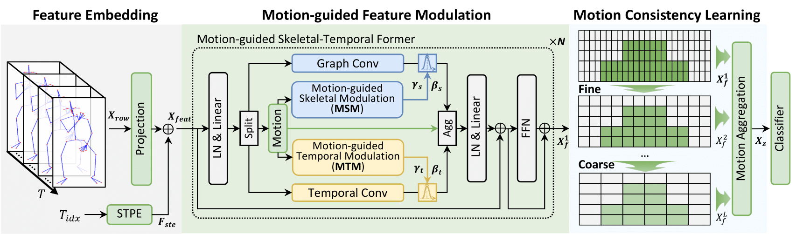

<div align="center">
<h1>Motion Matters: Motion-guided Modulation Network for Skeleton-based Micro-Action Recognition</h1>

[**Jihao Gu**](https://scholar.google.com/citations?hl=en&user=fSWwq3AAAAAJ)<sup>1</sup>, [**Kun Li**](https://scholar.google.com/citations?user=UQ_bInoAAAAJ)<sup>2 :email: </sup>, [**Fei Wang**](https://scholar.google.com/citations?user=sdqv6pQAAAAJ)<sup>3,4</sup>, [**Yanyan Wei**](https://scholar.google.com/citations?user=pjEvug0AAAAJ)<sup>3</sup>, [**Zhiliang Wu**]()<sup>2</sup>, [**Hehe Fan**](https://scholar.google.com/citations?user=hVuflMQAAAAJ)<sup>2</sup>,  and [**Meng Wang**](https://scholar.google.com/citations?user=rHagaaIAAAAJ)<sup>3</sup>

<sup>1</sup> University College London, London, United Kingdom  
<sup>2</sup> ReLER, CCAI, Zhejiang University, Hangzhou, China  
<sup>3</sup> Hefei University of Technology, Hefei, China  
<sup>4</sup> Institute of Artificial Intelligence, Hefei Comprehensive National Science Center, Hefei, China  

**This repository is the official implementation of the paper "Motion Matters: Motion-guided Modulation Network for Skeleton-based Micro-Action Recognition", accepted to ACM MM 2025.**

</div>

---

<p align="center">
  <a href="https://arxiv.org/abs/2507.21977" target="_blank"></a>
  <a href="https://huggingface.co/datasets/Geo2425/MMN" target="_blank"></a>
    <a href="https://drive.google.com/drive/folders/15yubRV4BOQ18QqFNbB2w6ui30S_UtM7W?usp=sharing" target="_blank"></a>
  <a href="https://visitor-badge.laobi.icu/badge?page_id=momiji-bit.MMN&left_color=green&right_color=red" target="_blank"></a>
  <a href="https://img.shields.io/github/issues-raw/momiji-bit/MMN?color=%23FF9600" target="_blank"></a>
  <a href="https://img.shields.io/github/stars/momiji-bit/MMN?style=flat&color=yellow" target="_blank"></a>
</p>





**Abstract.** Micro-Actions (MAs) are an important form of non-verbal communication in social interactions, with potential applications in human emotional analysis. However, existing methods in Micro-Action Recognition often overlook the inherent subtle changes in MAs, which limits the accuracy of distinguishing MAs with subtle changes. To address this issue, we present a novel Motion-guided Modulation Network (MMN) that implicitly captures and modulates subtle motion cues to enhance spatial-temporal representation learning. Specifically, we introduce a Motion-guided Skeletal Modulation module (MSM) to inject motion cues at the skeletal level, acting as a control signal to guide spatial representation modeling. In parallel, we design a Motion-guided Temporal Modulation module (MTM) to incorporate motion information at the frame level, facilitating the modeling of holistic motion patterns in micro-actions. Finally, we propose a motion consistency learning strategy to aggregate the motion cues from multi-scale features for micro-action classification. Experimental results on the [Micro-Action 52](https://github.com/VUT-HFUT/Micro-Action) and [iMiGUE](https://github.com/linuxsino/iMiGUE) datasets demonstrate that MMN achieves state-of-the-art performance in skeleton-based micro-action recognition, underscoring the importance of explicitly modeling subtle motion cues.

---

## 📦 Installation

```bash
git clone https://github.com/momiji-bit/MMN
cd MMN

```

```bash
conda create -n MMN python=3.12 -y
conda activate MMN

pip install torch  # cuda version
# pip3 install --pre torch --index-url https://download.pytorch.org/whl/nightly/cu129

pip install scikit-learn tensorboardX timm chardet h5py
pip install -e ./torchlight
pip install -e ./torchpack

```


## 🏋️‍♂️ Training & Testing

**Dataset (MA52 & iMiGUE)**

```bash
pip install -U huggingface_hub
huggingface-cli login
# export HF_ENDPOINT=https://hf-mirror.com  # (Optional) For users in China, enable the mirror
huggingface-cli download Geo2425/MMN --repo-type dataset --local-dir data

```

**Pretrain Model** 

- Download Link: [here](https://drive.google.com/drive/folders/15yubRV4BOQ18QqFNbB2w6ui30S_UtM7W?usp=sharing)

**Training** 

```bash
# Micro-Action 52 Dataset
python main.py --config ./config/train/MA52_J.yaml
python main.py --config ./config/train/MA52_B.yaml
# iMiGUE Dataset
python main.py --config ./config/train/iMiGUE_J.yaml
python main.py --config ./config/train/iMiGUE_B.yaml

```

**Testing**

```bash
# Micro-Action 52 Dataset
python main.py --config ./config/test/MA52_J.yaml --weights ./path_to_trained_model.pt
python main.py --config ./config/test/MA52_B.yaml --weights ./path_to_trained_model.pt
# iMiGUE Dataset
python main.py --config ./config/test/iMiGUE_J.yaml --weights ./path_to_trained_model.pt
python main.py --config ./config/test/iMiGUE_B.yaml --weights ./path_to_trained_model.pt

```

## 🙏 Reference

If you found this work useful, please consider citing:

```
@article{gu2025motion,
  title={Motion Matters: Motion-guided Modulation Network for Skeleton-based Micro-Action Recognition},
  author={Gu, Jihao and Li, Kun and Wang, Fei and Wei, Yanyan and Wu, Zhiliang and Fan, Hehe and Wang, Meng},
  journal={arXiv preprint arXiv:2507.21977},
  year={2025}
}

@article{guo2024benchmarking,
  title={Benchmarking Micro-action Recognition: Dataset, Methods, and Applications},
  author={Guo, Dan and Li, Kun and Hu, Bin and Zhang, Yan and Wang, Meng},
  journal={IEEE Transactions on Circuits and Systems for Video Technology},
  year={2024},
  volume={34},
  number={7},
  pages={6238-6252}
}

```

## 📧 Contact

For any questions, feel free to contact: Dr. Kun Li (kunli.hfut@gmail.com) and Mr. Jihao Gu (jihao.gu.23@ucl.ac.uk).

## 🤝 Acknowledgement

This code began with [SkateFormer](https://github.com/KAIST-VICLab/SkateFormer). We thank the developers for doing most of the heavy-lifting.


